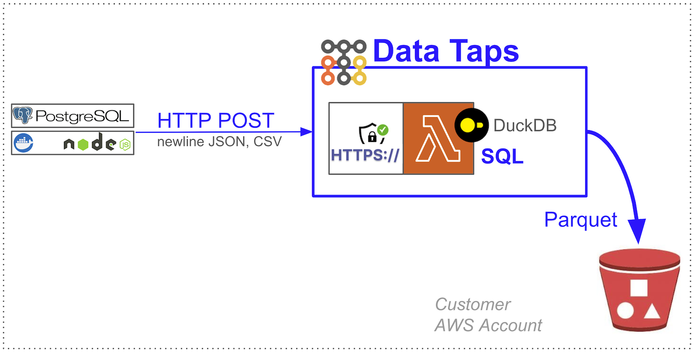

[FluentBit](https://github.com/boilingdata/data-taps-fluentbit-example) | [Web Analytics](https://github.com/boilingdata/data-taps-webanalytics-example) | [PostgreSQL CDC](https://github.com/boilingdata/data-taps-postgres-cdc) | [REST API](https://github.com/boilingdata/data-taps-nycopendata-example) | [OpenSearch/ES](https://github.com/boilingdata/data-taps-opensearch-to-s3)

# PostgreSQL CDC --> Data Tap --> S3 Parquet

<p align="center">
  
</p>

Example docker container running PostgreSQL server with [wal2json](https://github.com/eulerto/wal2json) logical CDC plugin, along with node server subscribing to the CDC stream and sending them to Data Taps public Tap URL.

## Data Tap

A Data Tap is a single AWS Lambda function with [Function URL](https://docs.aws.amazon.com/lambda/latest/dg/lambda-urls.html) and customized C++ runtime embedding [DuckDB](https://www.duckdb.org/). It uses streaming SQL clause to upload the buffered HTTP POSTed newline JSON data in the Lambda to S3, hive partitioned, and as ZSTD compressed Parquet. You can tune the SQL clause your self for filtering, search, and aggregations. You can also set the thresholds when the upload to S3 happens. A Data Tap runs already very efficiently with the smallest arm64 AWS Lambda, making it the simplest, fastest, and most cost efficient solution for streaming data onto S3 in scale. You can run it on [your own AWS Account](https://github.com/boilingdata/data-taps-template) or hosted by Boiling Cloud.

You need to have [BoilingData account](https://github.com/boilingdata/boilingdata-bdcli) and use it to create a [Data Tap](https://github.com/boilingdata/data-taps-template). The account is used to [fetch authorization tokens](https://github.com/boilingdata/data-taps-template?tab=readme-ov-file#3-get-token-and-ingestion-url-and-send-data) which allow you to send data to a Data Tap (security access control). You can also share write access (see the `AUTHORIZED_USERS` AWS Lambda environment variable) to other BoilingData users if you like, efficiently creating Data Mesh architectures.

## Run

```shell
yarn install
yarn build
yarn start
yarn logs
```
